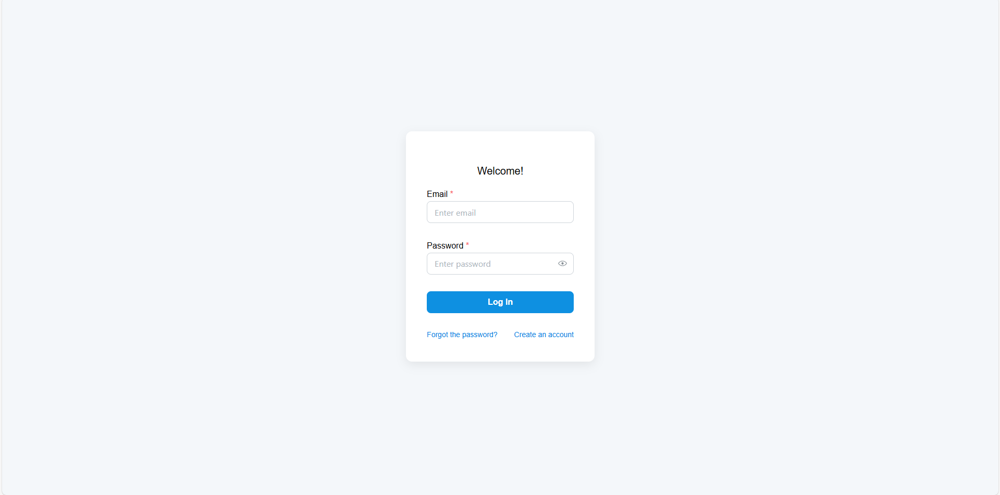

# URL-shortener
## Authors
- [@KMichaylov](https://github.com/KMichaylov)
## Introduction
A lightweight URL shortener application built as a personal hobby project to deepen my understanding of Spring Boot and React alongside UI kit libraries such as Mantine.



<br>
**Figure 1:** Screenshot for the Login page where you can either enter with existing account or create a new one


<br>
**Figure 2:** Main page where you can shorten the corresponding url


<br>
**Figure 3:** Result of the shortening, alongside with QR code generation


## Table of Contents

- [Features](#features)
- [Tech Stack](#tech-stack)
- [Build and Run](#build-and-run)
- [Points of Improvement](#points-of-improvement)
- [License](#license)

## Features

- Login and Registration
- Shorten URL
- Check simple analytics for URL
- Generate QR code for URL

## Tech Stack

**Client:** React, Mantine, Axios, React Router

**Server:** SpringBoot, JWT

**Database:** Postgresql

## Build and Run

1. Clone Repository
```
git clone https://github.com/KMichaylov/URL-shortener.git
cd my-project
```
2. Start the Backend (Spring Boot)
```
cd backend
./mvnw spring-boot:run
```
3. Start the Frontend (React)
```
cd frontend
npm install
npm run dev
```


## Points of Improvement
The following should be implemented in later versions:
- Add the Forgotten password functionality
- Make fully working Docker image and container
- Implemented more strictly the JWT policies
- Add architectural diagram


## License

[MIT](https://choosealicense.com/licenses/mit/)

